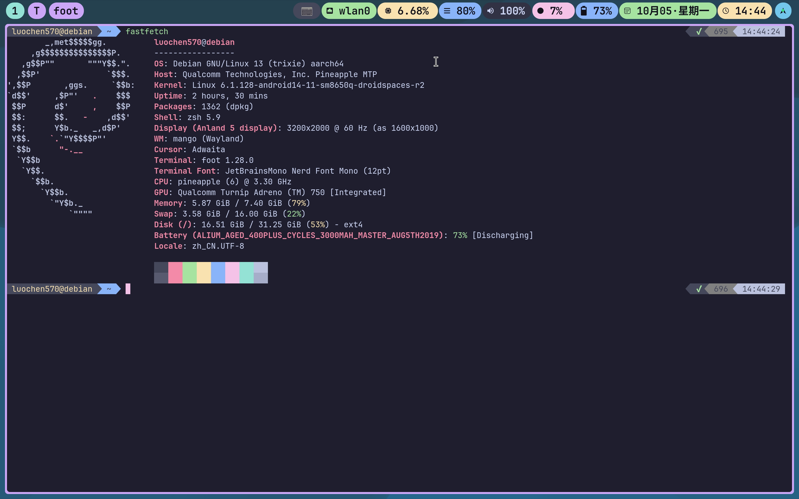

# Mango Anland 5 stack

[中文](README_zh.md)

This repository pins the four public `anland5` branches that make up the Mango native Anland 5 stack. The components are included as Git submodules so a checkout records the exact commits known to build together.



## Attribution and scope

Thanks to the original [Mango](https://github.com/mangowm/mango) and [Anland](https://github.com/SuperTurtleDev/anland) projects. This repository is a downstream integration snapshot for running Mango through Anland; it is not an upstream replacement for either project.

Most integration code in these `anland5` branches was written with AI assistance. Treat it as experimental integration code: review the diffs, rebuild locally, and keep the component repositories as the source of truth.

Reproducibility is not guaranteed. This case has only been reported working on a Lenovo Xiaoxin Pad Pro GT running Debian 13. The reported working devices/features are touch, mouse, touchpad, speakers, microphone, keyboard, and bidirectional clipboard.

Recommended reading before building or running:

- [Anland user guide](https://github.com/SuperTurtleDev/anland/blob/legacy/doc/UserManual/anland_guide.md)
- [Mango documentation](https://mangowm.github.io/docs/installation)
- [Droidspaces USB Manager notes](https://github.com/KDJCPM/Droidspaces-rootfs-KDE-builder/blob/main/README_english.md#droidspaces-usb-manager)

Install the Mesa driver stack that matches your device GPU before testing. On the tested Qualcomm/Adreno setup, use a Mesa build with a GPU-matched Freedreno OpenGL driver; use Zink only with a compatible Vulkan driver because Zink implements OpenGL on top of Vulkan. Point Mango/Anland at the working render node.

## Required build dependencies

Install the build tools and runtime development packages required by all submodules before following the build order below. Package names vary by distribution; the stack needs at least:

- C compiler, C++ compiler, `pkg-config`, `git`, `meson`, `ninja-build`, `cmake`
- Wayland, wayland-protocols, xkbcommon, pixman, libdrm, GBM/EGL/GLESv2
- libinput, udev/libudev, libseat, hwdata, libdisplay-info, libliftoff where available
- libpcre2-8, libcjson, and pangocairo for Mango
- PipeWire development files for Anland audio support
- Xwayland, xcb, xcb-icccm, and xcb-randr development files when building Mango with `-Dxwayland=enabled`

Install the matching Mesa runtime and development packages for your GPU. If the renderer falls back to software unexpectedly, fix the Mesa/DRM render-node setup before treating Mango or Anland as broken.


## Components

| Build order | Submodule | Branch | Pinned commit | Purpose |
|-------------|-----------|--------|---------------|---------|
| 1 | [`wlroots`](wlroots/) | `anland5` | `f2ff3e6c040f474ca71e8a5639997934f7a99142` | wlroots 0.20.2 with the external swapchain API Mango uses for Anland consumer-owned buffers, packaged as `libwlroots-0.20`. |
| 2 | [`scenefx`](scenefx/) | `anland5` | `612c23fa80106ae0968a417ac711f2e4e8b4c9ef` | SceneFX 0.5 built against the wlroots branch above and packaged as `libscenefx-0.5-0`. |
| 3 | [`anland`](anland/) | `anland5` | `fe7b844dbde5eb91fac8af8b19f28e54f9cf1f0b` | Anland producer library with the legacy facade exported through `display-producer` version 5.0.0. |
| 4 | [`mango`](mango/) | `anland5` | `3ac767b9a707d7e14038be81fd616a95c50df395` | Mango 0.17.5 with the native Anland backend, session scripts, runtime volume control, and deterministic Debian package versioning. |

Upstream repositories:

- <https://github.com/luochen88/wlroots/tree/anland5>
- <https://github.com/luochen88/scenefx/tree/anland5>
- <https://github.com/luochen88/anland/tree/anland5>
- <https://github.com/luochen88/mango/tree/anland5>

## Clone

Clone with submodules in one step:

```sh
git clone --recurse-submodules https://github.com/luochen88/mango-anland5.git
cd mango-anland5
```

If the repository was cloned without submodules:

```sh
git submodule update --init --recursive
```

To move every submodule to the latest published `anland5` branch tip instead of the pinned commits:

```sh
git submodule update --remote --merge
```

Stage and commit the updated submodule pointers afterward if you want to make a new tested stack snapshot:

```sh
git add wlroots scenefx anland mango
git commit -m "chore: update Mango Anland 5 stack pins"
```

## Build and install

Build and install in dependency order. The Debian packaging uses `/usr` and the host multiarch libdir; manual local installs may use `/usr/local` if `PKG_CONFIG_PATH` and `LD_LIBRARY_PATH` point at the same prefix for every component.

### Debian package metadata

Each submodule contains Debian packaging for the pinned ABI:

| Submodule | Source package | Runtime package | Development package |
|-----------|----------------|-----------------|---------------------|
| `wlroots` | `wlroots` | `libwlroots-0.20` | `libwlroots-0.20-dev` |
| `scenefx` | `scenefx` | `libscenefx-0.5-0` | `libscenefx-0.5-dev` |
| `anland` | `anland` | `libdisplay-producer5` | `libdisplay-producer-dev` |
| `mango` | `mango` | `mango-anland5` | — |

Build packages in the same order. `scenefx` build-depends on the pinned `libwlroots-0.20-dev`; `mango-anland5` build-depends on the pinned wlroots, SceneFX, and Anland development packages.

### 1. wlroots

```sh
arch=$(dpkg-architecture -qDEB_HOST_MULTIARCH)
meson setup wlroots/build --prefix=/usr --libdir="lib/$arch" \
  -Dbackends=drm,libinput,x11 \
  -Drenderers=gles2 \
  -Dallocators=gbm,udmabuf \
  -Dsession=enabled \
  -Dxwayland=enabled \
  -Dexamples=false \
  -Dcolor-management=disabled \
  -Dlibliftoff=enabled \
  -Dxcb-errors=enabled
meson compile -C wlroots/build
sudo meson install -C wlroots/build
```

### 2. SceneFX

```sh
arch=$(dpkg-architecture -qDEB_HOST_MULTIARCH)
meson setup scenefx/build --prefix=/usr --libdir="lib/$arch" \
  -Dexamples=false \
  -Drenderers=gles2 \
  -Dtracy_enable=false \
  -Dcolor-management=disabled
meson compile -C scenefx/build
sudo meson install -C scenefx/build
```

### 3. Anland producer library

```sh
arch=$(dpkg-architecture -qDEB_HOST_MULTIARCH)
cmake -S anland -B anland/build -G Ninja \
  -DCMAKE_BUILD_TYPE=Release \
  -DCMAKE_INSTALL_PREFIX=/usr \
  -DCMAKE_INSTALL_LIBDIR="lib/$arch"
cmake --build anland/build --parallel
sudo cmake --install anland/build
pkg-config --modversion display-producer
```

Expected `pkg-config --modversion display-producer` output:

```text
5.0.0
```

### 4. Mango

```sh
arch=$(dpkg-architecture -qDEB_HOST_MULTIARCH)
meson setup mango/build --prefix=/usr --libdir="lib/$arch" \
  -Danland=enabled \
  -Dxwayland=enabled \
  -Dversion_suffix=release
meson compile -C mango/build
sudo meson install -C mango/build
```

## Run Mango on Anland

The Anland backend is selected by `ANLAND_SOCKET`. The default session scripts expect the daemon socket at `/run/display.sock` and the render node at `/dev/dri/renderD128`.

Manual session:

```sh
export ANLAND_SOCKET=/run/display.sock
export ANLAND_DRM_DEVICE=/dev/dri/renderD128
export XDG_RUNTIME_DIR=/run/user/$(id -u)
exec mango -s 'mangobar'
```

Systemd user session after installation:

```sh
systemctl --user enable --now mango-anland.service
mango-anland {start|stop|restart|kill|status}
```

Runtime audio volume state is controlled by:

```sh
anland-volume.sh {get|up|down|toggle|set <0-150>}
```

The state file is `$XDG_RUNTIME_DIR/anland-volume-state`; default state is `100 0`.

## Verification used for this snapshot

The pinned commits were checked locally with a clean staged install under `/tmp/anland-stack-stage`:

```sh
meson setup /tmp/stage-wlroots wlroots --prefix=/usr --libdir=lib/$(dpkg-architecture -qDEB_HOST_MULTIARCH) -Dbackends=drm,libinput,x11 -Drenderers=gles2 -Dallocators=gbm,udmabuf -Dsession=enabled -Dxwayland=enabled -Dexamples=false -Dcolor-management=disabled -Dlibliftoff=enabled -Dxcb-errors=enabled
meson compile -C /tmp/stage-wlroots
DESTDIR=/tmp/anland-stack-stage meson install -C /tmp/stage-wlroots
meson setup /tmp/stage-scenefx scenefx --prefix=/usr --libdir=lib/$(dpkg-architecture -qDEB_HOST_MULTIARCH) -Dexamples=false -Drenderers=gles2 -Dtracy_enable=false -Dcolor-management=disabled
meson compile -C /tmp/stage-scenefx
DESTDIR=/tmp/anland-stack-stage meson install -C /tmp/stage-scenefx
cmake -S anland -B /tmp/stage-anland -G Ninja -DCMAKE_BUILD_TYPE=Release -DCMAKE_INSTALL_PREFIX=/usr -DCMAKE_INSTALL_LIBDIR=lib/$(dpkg-architecture -qDEB_HOST_MULTIARCH)
cmake --build /tmp/stage-anland --parallel "$(nproc)"
DESTDIR=/tmp/anland-stack-stage cmake --install /tmp/stage-anland
meson setup /tmp/stage-mango mango --prefix=/usr --libdir=lib/$(dpkg-architecture -qDEB_HOST_MULTIARCH) -Danland=enabled -Dxwayland=enabled -Dversion_suffix=release
meson compile -C /tmp/stage-mango
DESTDIR=/tmp/anland-stack-stage meson install -C /tmp/stage-mango
```

Additional smoke checks:

```sh
(cd wlroots && git diff --check)
(cd scenefx && git diff --check)
(cd anland && git diff --check)
(cd mango && git diff --check)
sh -n mango/scripts/mango-anland mango/scripts/anland-volume.sh
```

`anland-volume.sh` with a temporary `XDG_RUNTIME_DIR` returned:

```text
get -> 100 0
set 80 -> 80 0
toggle -> 80 1
```

`/tmp/anland-stack-stage/usr/bin/mango -v` returned:

```text
mango 0.17.5(release)
```

A runtime smoke with `/run/display.sock` and `/dev/dri/renderD128` present started Mango with the service-equivalent environment and kept it alive until timeout. The local smoke log contained only an already-used Xwayland display socket warning and missing user-bus messages. The Lenovo Xiaoxin Pad Pro GT report above says Android-side visual output, touch, mouse, touchpad, speakers, microphone, keyboard, and bidirectional clipboard worked on Debian 13; those Android-side behaviors were not independently re-tested as part of this repository snapshot.

`dpkg-checkbuilddeps` parsed all four packages. This workstation lacked `debhelper-compat (= 13)` and the freshly packaged pinned development packages, so full `.deb` builds were not run here.

## Repository policy

This repository is only the stack manifest and documentation. Product code changes live in the component repositories above. Update this repository by advancing submodule pointers after rebuilding and re-smoking the complete stack.
